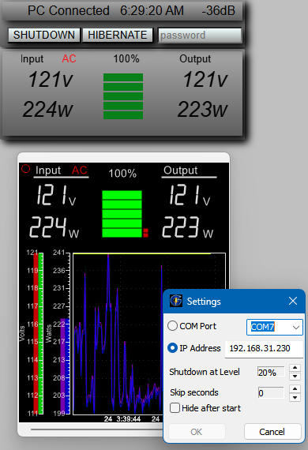

# GoldenChute
GoldenMate UPS monitor and Windows software  
  
This is a simple modification for the GoldeMate UPS to access the information displayed as well as safely shut a Windows PC down before the battery runs down. The thing that's important when using a UPS.  
  
  
  
The top is the web page for remote access, and the bottom is the Windows app.  

This mod requires opening the case of the UPS and plugging in a small board inline with the front display. It's a segmented display with SPI interface, so the ESP32 decodes all the bits and translates them to something usable. The data is only sent to the display when the power button is short-pressed, so this also simulates the button. The 5V power for the ESP32 needs to be external since the display 5V is only on when the display is powered, so run a USB cable to the rear panel and cut a small notch so the case can slide back on, and connect to PC or USB power supply (connected to the UPS, so it's powered on battery).  
  
Pics soon. I promise. The revised board isn't done yet. The 2-pin connector just doesn't clear the ESP32 module well.  
  
**Parts needed:**  
-  ESP32-C3-super mini  
-  G3VM-61GR2 (SSR)  
-  200 ohm 0805 resistor  
-  7-pin 0.1" pinheader M (JST-XX would be better, not entirely sure which one yet)  
-  7-pin 0.1" pinheader F  
-  2-pin connector M (some kind of JST)  
-  2-pin connector F  
  
**Windows app:**  
Extract the exe and move it to somewhere like C:\Goldenamte.  
Right click on the exe, and select "Show more Options" then select "Create shortcut" then move the shortcut to:  
  C:\Users\[Your Account]\AppData\Roaming\Microsoft\Windows\Start Menu\Programs\Startup  
Double-click to run the app.  Go to the tray, and right click the icon for the menu. Select "Settings" and enter the IP address of the ESP32 device such as "192.168.0.100"  
If it connects, there should be a small red circle in the top left of the app. This will blink when data is recieved.  
Clicking on the top-right corner of the app will hide it.  
Other settings: COM Port (not used yet), and % to shut down. 100% is immediate, and 0% is never. There is a 10 second delay when it reaches the desired %, then it will hibernate or hibrid-sleep if that is set up properly, otherwise it will shut down. The wweb page also allows manual remote shutdown/hibernate. Test it once to esnure it works properly.  

**Note:** This first version of the app doesn't reconnect on lost connections. It will be flushed out soon, as well as indication of connection on the web page.  
