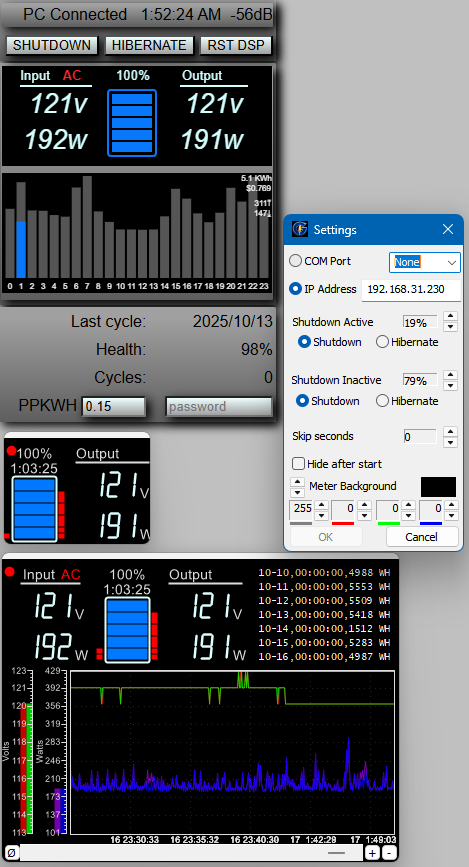
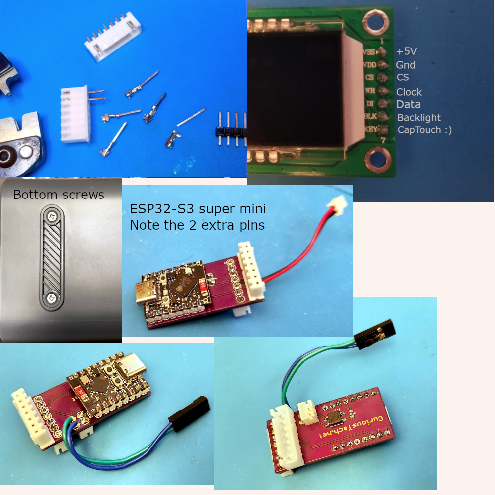
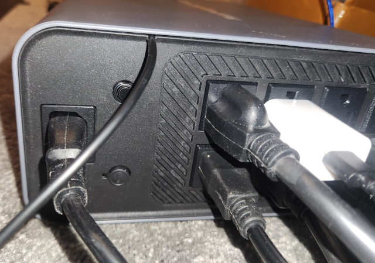

# GoldenChute
GoldenMate UPS monitor and Windows shutdown software  
  
This is a simple modification for the GoldeMate UPS to access the information displayed as well as safely shut a Windows PC down before the battery runs down. One of the most important features of a UPS.  
  
  
  
The top left is the web page for remote access. The bottom and smaller windows are the Windows app.  
  
This mod requires opening the case of the UPS and plugging in a small board inline with the front display. It's a segmented display with SPI interface, so the ESP32 decodes all the segment bits and translates them to something usable. The data is only sent to the display for 60 seconds when the power button is short-pressed, so this also simulates the button (in parallel). The 5V power for the ESP32 needs to be external since the display 5V is only on when the display is powered, and may not support the current requirement, so run a USB cable to the rear panel and cut a small notch so the case can slide back on, and connect to PC or USB power supply (powered by the UPS, so it's powered on battery).  

Note: The interface could easily be changed to any small Arduino or microcontroller, since it only connects to 3 pins for data (no ground) and momentarily shorts the power button (28V or 56V pulled low).  
  
I beleve the first model had a push-on/push-off button and the display stayed on. For that model, all you need is the PCB, ESP32, and 7 pin connectors. Leave out the solid state relay, R2 and 2 pin connectors.  
  
**Parts needed:**  
-  [PCB r3](https://oshpark.com/shared_projects/PVSbJPnb) ESP32-S3 or C3
-  [ESP32-C3-super mini](https://www.aliexpress.us/item/3256807353297685.html?spm=a2g0o.tesla.0.0.68bcQMQPQMQPhl&pdp_npi=5%40dis%21USD%21%242.70%21%240.99%21%21%21%21%21%40210318ec17532528750118282ee624%2112000041210885173%21btf%21%21%21%211%210&afTraceInfo=1005007539612437__pc__c_ppc_item_bridge_pc_jfy_wf__5EfmYTO__1753252875356&gatewayAdapt=glo2usa4itemAdapt), or [ESP32-S3-super mini](https://www.aliexpress.us/item/3256809251035142.html?src=google&pdp_npi=4%40dis%21USD%219.58%214.77%21%21%21%21%21%40%2112000049096706686%21ppc%21%21%21&snps=y&snpsid=1&retailTag=FullHosting&traffic_server_nav=true&src=google&albch=shopping&acnt=752-015-9270&isdl=y&slnk=&plac=&mtctp=&albbt=Google_7_shopping&aff_platform=google&aff_short_key=_oDeeeiG&gclsrc=aw.ds&albagn=888888&ds_e_adid=765876812054&ds_e_matchtype=search&ds_e_device=c&ds_e_network=g&ds_e_product_group_id=2432726605827&ds_e_product_id=en3256809251035142&ds_e_product_merchant_id=5551326180&ds_e_product_country=US&ds_e_product_language=en&ds_e_product_channel=online&ds_e_product_store_id=&ds_url_v=2&albcp=22836103672&albag=181655310623&isSmbAutoCall=false&needSmbHouyi=false&gad_source=1&gad_campaignid=22836103672&gbraid=0AAAAA_eFwRAyv9Rq_0If5BZwSjsvJ58sZ&gclid=CjwKCAjw_-3GBhAYEiwAjh9fUAt70B5cIL68h4UN8Gi5cf2Gmbqrgfq4Euy-TqJON3bV4UEJ49vdTxoCdyoQAvD_BwE&gatewayAdapt=glo2usa) for USB-HID support (native Windows, NUT, etc.)  
-  AQY282S (SSR)  I used this one because it's cheap and currently well stocked.  
-  R2 470 ohm 0805 resistor  
-  R1 & R3 not used (for testing only)  
-  M & F [JST-XH](https://www.aliexpress.us/item/3256806894018733.html?spm=a2g0o.productlist.main.4.6628yYL5yYL5tc&aem_p4p_detail=202507281307327593555654334650005149445&algo_pvid=4fba3b75-b535-414b-a67c-6606d6a9a4fe&algo_exp_id=4fba3b75-b535-414b-a67c-6606d6a9a4fe-3&pdp_ext_f=%7B%22order%22%3A%221150%22%2C%22eval%22%3A%221%22%7D&pdp_npi=4%40dis%21USD%211.69%210.99%21%21%211.69%210.99%21%402101c5ac17537332524376501e04f3%2112000039333381516%21sea%21US%212968017294%21ABX&curPageLogUid=1BpFPZiG5hsA&utparam-url=scene%3Asearch%7Cquery_from%3A&search_p4p_id=202507281307327593555654334650005149445_1) or [XHB](https://www.aliexpress.com/p/tesla-landing/index.html?UTABTest=aliabtest110188_5910&src=criteo&albch=criteo_New&acnt=criteo-B4&albcp=232508&device=pc&clickid=688081f42944a328ac413444d0863805_1753252340_3256806815272828&cto_pld=v5yJr7dcAABvALKgmy4wTg&aff_fcid=bcbb53245af5402988fd7376c89645a9-1753252356158-04892-UneMJZVf&aff_fsk=UneMJZVf&aff_platform=aaf&sk=UneMJZVf&aff_trace_key=bcbb53245af5402988fd7376c89645a9-1753252356158-04892-UneMJZVf&terminal_id=1a5a9f1087de44a890966b5bbd3921da&scenario=c_ppc_item_bridge&productId=3256806815272828&_immersiveMode=true&withMainCard=true&OLP=1094500108_f_group1&o_s_id=1094500108&afSmartRedirect=n) (clip type) 7P 2.54mm, or 7P 0.1" pinheader  
-  2P 2.54mm/0.1" connector M 
-  2P 2.54mm/0.1" connector F + 2 wires (2-3 inches) Note: The button is non-polarized (The AliExpress above didn't fit the 2 pin) Dupont will work if nothing else.  
  
  
  
  
Remove the 2 screws under each rubber foot. Slide the cover off (to the front).  Remove the 6 screws around the front panel.  
  
The female XHB (XH works well, and a plain female pinheader actually holds well if you can't find XH/B) connector needs pins or wire lead clippings crimped to make it solder to a PCB. I used male pinheader pins. Install the 2-pin connector and wires before the ESP32 for ease.  
  
  
Cut a notch in the rear panel to fit the USB cable.  
  
**Arduino:**  
Settings for router SSID and SSID password are in Config.h, as well as the remote password for web control. If they aren't set or the SSID changes, EspTouch can be used.  
Compiling the code should be easy. Most information is in UPS.ino, like where to get the libraries needed, and settings for the ESP32-C3-super mini such as enabling CDC on boot (for serial output).  
There's code in UPS.ino to setup the initialDate, lastCycleDate, Cycles and percent to be used once, and commented out if desired.  

The ESP32-S3 super mini is mostly pin compatible, and has HID support for UPS emulation. It has 2 more pins (1 per side) that just overhang on the PCB. The current GPIO pins in the code for the C3 are incorrect for the r3 board. Just 1 pin is different. There are likely different models of the S3 also. Just make sure GND is pin 2.  
  
**Web page:**  
The HIBERNATE and SHUTDOWN buttons send a message to the Goldenmate app to start the shutdown or hibernate process.  
The POWER OFF button will hold the power button for 5 seconds to shut the UPS off. This will cut power to everything, including the ESP32 most likely.  
RESET DISP causes a timeout in the display restart timer. When teh USP returns to AC power, once in a while the display malfunctions, but the data is still good. This just fixes it.  
HID Warn % is what Windows uses to pop up a warning.  
HID shutdown % is what Windows uses to shutdown when the battery level reaches that value. Set the warning above the shutdown. These are overridden by settings in Windows, though, so probably not useful.  
PPKWH (price per killowatt hour) is used for, well, calcuating cost.  
password needs to be the same as what's in Config.h and needs to be set to allow any input (button presses or value changes). You can leave it blank any other time.  
  
**Windows app:**  
Extract the exe and move it to somewhere like C:\Goldenmate.  The startup folder symbolic link will auto-generate to this path.  
Clicking on the top-right corner of the app will hide it.  
Right-click for context menu (settings, quit, clear log/chart)  
The outage and daily WH log (top right area, hidden when small) is blank until an entry is created.  Entries are comma delimited lines saved in a file in the local exe folder, named ups_log.txt (or ups_log1.txt for the 2nd instance...).  
  
**Settings:**  
Right-click in the window, or go to the tray, and right click the icon for the menu. Select "Settings" and enter the IP address of the ESP32 device in the format "192.168.xxx.xxx" which you can find in the Arduino IDE ports, named UPS (192.168.xxx.xxx).  Your router should also be on UPS when using this method.  
If it connects, there should be a small red circle in the top left of the app. This will blink when data is received. Serial is the same.  
COM Port (Note: using serial will cause the ESP32 to reset every time the app exits or another app accesses the COM port, which loses WH history and may get off track if charging).  
The radio buttons allow selecting either COM or websocket.  
 Note: When using HID, the Windows app will not be able to use serial, but can connect to the IP address. There's no resetting, which is better, but be careful of the HID shutdown % along with the app shutdown %. The app should be set higher, and HID can be fallback if it's not running for any reason.  
Percent to shut down: Active (red bars left of battery in the main display and tray icon) and Inactive (right red bars) depends on whether the monitor is in standby. The depth of discharge (D.O.D.) determines the impact on health. When inactive, it should shut down at 70% for best health. When active, more time can be allowed for manual shutdown. The % is just the bar levels, not actual percent (which could possibly be inaccurate). There is a 10 second delay when it reaches the desired %, then it will shut down or hibernate/hibrid-sleep if that is set up properly and doesn't fail, otherwise it will shut down.  
Note: Hibrid-sleep can wake immediately by odd USB devices if not set up properly. It should be tested before use. It will also slowly drain the battery over time.  
Skip seconds: 0 will add data to the chart every second (total 24 hours). 1 would be 48 hours, but records peak values of 2 seconds.  
The web page also allows manual remote shutdown/hibernate. The password will need to be the same here as in Config.h  Test it once to esnure it works properly.  
Alerts currently just cause the window to popup and show red text over the "Input" label, such as "Serial timeout/in use" or WebSocket disconnected" with annoying audio.  
Power off after [30] seconds: Will turn the UPS power off (cutting power to everything on it) the delayed time (15 secs to 60 mins) after the PC begins shutdown/hibernate.  
 Note:The ESP will also lose power, so there's no way to remotely power it back on.  
Hide after start causes the window to hide 4 seconds after startup.  
